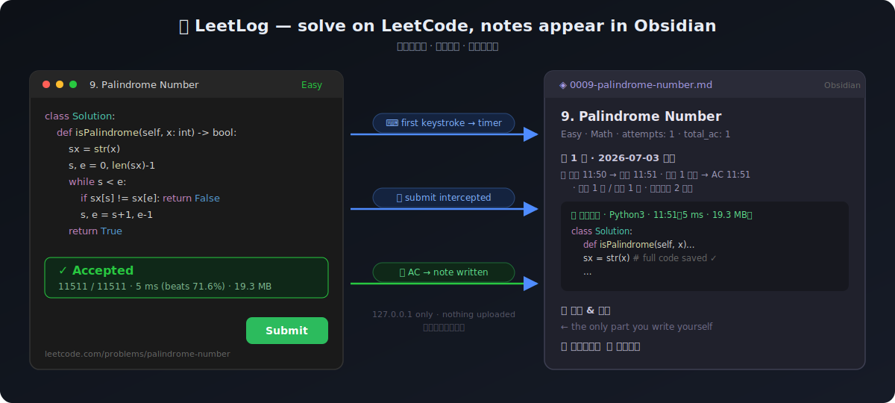

<div align="right"><a href="./README.md">English</a> | 简体中文</div>

# 📗 LeetLog

**把你的 LeetCode 刷题过程自动记录进本地 Obsidian —— 你只负责写感悟。**



在题目页**敲下第一个键**自动开始计时，每次提交自动计数，**AC 的瞬间**把通过代码、
运行数据、用时写进结构化的 Obsidian 笔记。重做旧题时，同一篇笔记累积每一次尝试——
一眼看到过去的自己是怎么想的，温故知新。

## 它和现有工具的区别

| | LeetHub 系 | 计时器扩展 | LeetPlug | **LeetLog** |
|---|---|---|---|---|
| AC 代码归档 | ✅ 推到 GitHub | ❌ | ❌ | ✅ 写进本地笔记 |
| 自动计时（首次击键起） | ❌ | ✅ | ✅ | ✅ |
| 提交/通过次数 | ❌ | ❌ | ✅ | ✅ |
| 重做历史 | ❌ | ❌ | 部分 | ✅ |
| 感悟/笔记空间 | ❌ | ❌ | ❌ | ✅ 核心设计 |
| 数据去向 | GitHub | 本地 | 第三方服务器 | **只在你电脑里** |

## 工作原理

```
LeetCode 页面
  │  interceptor.js（拦截 fetch/XHR：提交时捕获代码，主动轮询判题结果，检测首次击键）
  ▼
content.js ──POST──▶ 本地桥接服务 127.0.0.1:8763（leetlog_server.py）
                          │  查题目元数据、计时、计数、组装 Markdown
                          ▼
                你的 vault/LeetCode/0013-roman-to-integer.md
```

不抓取页面 DOM（LeetCode 改版就失效），而是拦截网络层：提交请求体里有你的代码，
判题接口里有 Accepted/运行时间/内存。结果轮询走双通道：经典 `/check/` 接口 +
GraphQL `submissionDetails` 兜底。**所有数据只在 `leetcode.com 页面 → 127.0.0.1 → 本地文件`
之间流动，无任何外部上传。**

## 安装（两步）

### 1. 启动本地桥接服务

```bash
python3 server/leetlog_server.py
```

零依赖（Python 标准库）。首次运行自动探测你的 Obsidian vault 并生成配置
`~/.config/leetlog/config.json`（可改 vault 路径和笔记文件夹）。

<details>
<summary>开机自启（macOS launchd，可选）</summary>

```bash
cat > ~/Library/LaunchAgents/com.leetlog.server.plist << 'EOF'
<?xml version="1.0" encoding="UTF-8"?>
<!DOCTYPE plist PUBLIC "-//Apple//DTD PLIST 1.0//EN" "http://www.apple.com/DTDs/PropertyList-1.0.dtd">
<plist version="1.0"><dict>
  <key>Label</key><string>com.leetlog.server</string>
  <key>ProgramArguments</key><array>
    <string>/usr/bin/python3</string>
    <string>/绝对路径/leetlog/server/leetlog_server.py</string>
  </array>
  <key>RunAtLoad</key><true/>
  <key>KeepAlive</key><true/>
</dict></plist>
EOF
launchctl load ~/Library/LaunchAgents/com.leetlog.server.plist
```
</details>

### 2. 装浏览器扩展

Chrome / Edge / Arc：`chrome://extensions` → 打开右上角"开发者模式" →
"加载已解压的扩展程序" → 选 `extension/` 文件夹。

点扩展图标可以看到 🟢 服务状态、笔记位置、进行中的题。

## 生成的笔记

````markdown
---
id: 13
title: "Roman to Integer"
difficulty: Easy
tags: [Hash Table, Math, String]
attempts: 2
first_attempt: 2026-07-03
last_attempt: 2026-08-10
total_submissions: 5
total_ac: 2
---

# 13. Roman to Integer

## 第 1 次 · 2026-07-03 周五
⏱ 开始 10:34 → 首提 10:42 · 编码 8 分钟 → AC 10:49 · 提交 2 次 / 通过 1 次 · 本题停留 15 分钟

### ✅ 通过代码 · python3 · 10:49（12 ms · 17.1 MB）
```python
class Solution: ...
```

### 💭 思路 & 感悟
### 📚 学到了什么（新函数 / 新数据结构 / 新套路）
### 🔀 多种解法
````

frontmatter 面向 Obsidian Properties / Dataview：一句查询就能做"错题本"、
"超过 30 天没碰的题"、"按标签的正确率"。

## 计时语义

```
⏱ 开始 11:10 → 首提 11:18 · 编码 8 分钟 → AC 11:25 · 提交 2 次 / 通过 1 次 · 本题停留 20 分钟
   ↑首次击键     ↑首次提交    ↑击键→首提      ↑首个 Accepted                    ↑击键→离开页面/切换题目
```

- **编码时间** = 敲下第一个键 → 首次提交（真实的"写题"时长）
- **本题停留** = 敲下第一个键 → 关闭页面 / 切到另一道题（含提交后复盘、优化的时间）
- AC 后继续优化再提交：代码块追加、计数继续累积
- 离开后 6 小时内回来算同一次做题；超过则自动开"第 N+1 次"

## 会话规则

- 判题结果通过双通道获取：拦截到 submission_id 后主动轮询 `/check/` 接口，失效自动切换
  GraphQL `submissionDetails` 兜底（不依赖页面 DOM，不受 UI 改版影响）
- 服务重启不丢状态（会话存在 `~/.config/leetlog/state.json`）
- 服务没开时做题？事件会丢（浏览器控制台有 `[LeetLog]` 提示）。可用姊妹项目
  [lc-notes](../lc-notes) 的 `lc sync` 补记

## 已知边界

- 依赖 LeetCode 当前的提交接口（`/submit/` + `/submissions/detail/<id>/check/`）；
  接口大改需要更新 interceptor（比 DOM 稳定得多）
- Chrome 111+（content script MAIN world）
- leetcode.cn 的接口路径相同已包含匹配，但未充分测试

## Roadmap

**v1.0（当前）**：扩展 + Python 桥接服务，已在真实 LeetCode 环境端到端验证

**v2.0 —— 去掉"手动开服务"（两条路线）**
- [ ] **Obsidian 插件版桥接（主推）**：把桥接服务用 TypeScript 移植成 Obsidian 社区插件
      （Obsidian 插件运行在 Electron，可以直接监听 localhost，先例：Local REST API 插件）。
      用户体验 = 装 Chrome 扩展 + 装 Obsidian 插件，零终端零 Python，插件商店分发/自动更新
- [ ] **纯扩展模式（备选）**：File System Access API 让用户选一次 vault 文件夹，扩展直接写
      Markdown，连 Obsidian 都不用装（适合非 Obsidian 用户）
- [ ] 扩展侧离线队列：桥接不在线时把事件存 `chrome.storage`，恢复后补发，永不丢事件

**功能向**
- [ ] 打包发布 Chrome Web Store / Firefox
- [ ] 捕获题目描述存入笔记（离线可读）
- [ ] Dataview 索引页模板（错题本 / 间隔重做提醒）
- [ ] `lc import`：把旧的手写笔记拆分导入
- [ ] Run（不提交的测试运行）次数统计

## License

MIT
